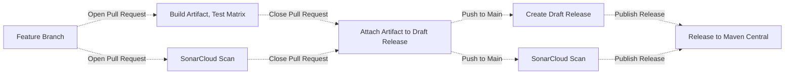

# Liquibase Reusable Workflows

## Introduction to GitHub Actions

With [GitHub Actions](https://github.com/features/actions), you can create custom workflows for the
software development lifecycle directly in your Github repository. These workflows consist of
different tasks, called actions, that can be executed automatically when certain events occur.

At Liquibase, we use GitHub Actions for a wide range of tasks involved in the build, test, and release of extensions.
## About reusable workflows

To avoid code duplication of GitHub Actions workflow files across thousands of repositories, we
utilize [reusable workflows](https://docs.github.com/en/actions/using-workflows/reusing-workflows).
This allows us to DRY (don't repeat yourself) configurations, so we don't have to copy and paste
workflows from one repository to another.

## Calling reusable workflows

In the calling workflow file, use the `uses` property to specify the location and version of a
reusable workflow file to run as a job.

```yml
name: {Job name}
on:
  pull_request:
jobs:
  {workflow}:
    uses: liquibase/build-logic/.github/workflows/{workflow}.yml@main
```

## Example Extension Workflow



Please review the below table of reusable workflows and their descriptions:

| Workflow                                | Description                                                                    |
|-----------------------------------------|--------------------------------------------------------------------------------|
| `build-artifact.yml`                    | Runs maven build and saves artifacts                                           |
| `create-release.yml`                    | Runs Release Drafter to auto create draft release notes                        |
| `extension-attach-artifact-release.yml` | Attaches a tested artifact to the draft release                                |
| `extension-release-published.yml`       | Publishes a release to Maven Central                                           |
| `os-extension-test.yml`                 | Unit tests across build matrix on previously built artifact                    |
| `pro-extension-test.yml`                | Same as OS job, but with additional Pro-only vars such as License Key          |
| `sonar-pull-request.yml`                | Code Coverage Scan for PRs.  Requires branch name parameter                    |
| `sonar-push.yml`                        | Same as PR job, but for pushes to main. Does not require branch name parameter |  
| `snyk-nightly.yml`                      | Nightly Security Scans                                                         |
| various shell scripts                   | helper scripts for getting the draft release, signing artifacts, and uploading assets |