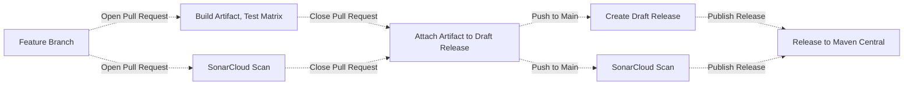

# Liquibase Reusable Workflows

## Introduction to GitHub Actions

With [GitHub Actions](https://github.com/features/actions), you can create custom workflows for the
software development lifecycle directly in your Github repository. These workflows consist of
different tasks, called actions, that can be executed automatically when certain events occur.

At Liquibase, we use GitHub Actions for a wide range of tasks involved in the build, test, and release of extensions.
## About reusable workflows

To avoid code duplication of GitHub Actions workflow files across thousands of repositories, we
utilize [reusable workflows](https://docs.github.com/en/actions/using-workflows/reusing-workflows).
This allows us to DRY (don't repeat yourself) configurations, so we don't have to copy and paste
workflows from one repository to another.

## Calling reusable workflows

In the calling workflow file, use the `uses` property to specify the location and version of a
reusable workflow file to run as a job.

```yml
name: {Job name}
on:
  pull_request:
jobs:
  {workflow}:
    uses: liquibase/build-logic/.github/workflows/{workflow}.yml@main
```

### Calling reusable workflows with parameters

`os-extension-test.yml` and `pro-extension-test.yml` are triggered by a workflow call event and runs tests for Liquibase extensions (os/pro) on different Java versions and operating systems. The `java` input specifies the Java versions to test, and the `os` input specifies the operating systems to test. Both inputs are required and have default values.

```yml
name: {Job name}
on:
  pull_request:
jobs:
  {workflow}:
    uses: liquibase/build-logic/.github/workflows/{workflow}.yml@main
    with:
      java: '[17, 18]'
      os: '["ubuntu-latest", "windows-latest"]'
```

If inputs are not provided, `'[8, 11, 17, 18]'` and `'["ubuntu-latest", "windows-latest"]'` will be used as default values

## Example Build/Test/Release Extension Workflow



Please review the below table of reusable workflows and their descriptions:

| Workflow                                | Description                                                                           |
|-----------------------------------------|---------------------------------------------------------------------------------------|
| `build-artifact.yml`                    | Runs maven build and saves artifacts                                                  |
| `create-release.yml`                    | Runs Release Drafter to auto create draft release notes                               |
| `deb-packaging.yml`                     | Creates and uploads deb packages                                                      |
| `extension-attach-artifact-release.yml` | Attaches a tested artifact to the draft release                                       |
| `extension-release-published.yml`       | Publishes a release to Maven Central                                                  |
| `extension-update-version.yml`          | Updates release and development `pom.xml` versions                                    |
| `os-extension-test.yml`                 | Unit tests across build matrix on previously built artifact                           |
| `pro-extension-test.yml`                | Same as OS job, but with additional Pro-only vars such as License Key                 |
| `sonar-pull-request.yml`                | Code Coverage Scan for PRs.  Requires branch name parameter                           |
| `sonar-push.yml`                        | Same as PR job, but for pushes to main. Does not require branch name parameter        |  
| `snyk-nightly.yml`                      | Nightly Security Scans                                                                |
| various shell scripts                   | helper scripts for getting the draft release, signing artifacts, and uploading assets |

## Requirements
### pom.xml
The pom must meet all the requirements from sonatype: https://central.sonatype.org/publish/requirements/#a-complete-example-pom

#### Jacoco
Jacoco must be configured and exporting test results.
```xml
<plugin>
    <groupId>org.jacoco</groupId>
    <artifactId>jacoco-maven-plugin</artifactId>
    <version>0.8.8</version>
    <configuration>
        <fileSets>
            <fileSet>
                <directory>target</directory>
                <includes>
                    <include>**/jacoco.exec</include>
                </includes>
            </fileSet>
        </fileSets>
    </configuration>
</plugin>
```
#### Surefire
All unit tests must run and pass with `surefire:test`. If any test require additional setup, such as docker, they will need to run separately from the reusable build logic. 

```xml
<plugin>
    <artifactId>maven-surefire-plugin</artifactId>
    <version>2.22.2</version>
    <configuration>
        <redirectTestOutputToFile>true</redirectTestOutputToFile>
        <reportFormat>plain</reportFormat>
    </configuration>
</plugin>
```

#### Artifacts
The following artifacts must be created `mvn clean package`. If the javadoc and sources should not be public, please copy the contents of the readme for those files. This is based on the recommendation from sonatype: https://central.sonatype.org/publish/requirements/#supply-javadoc-and-sources.

* {artifactId}-{version}.jar
* {artifactId}-{version}.pom
* {artifactId}-{version}-javadoc.jar
* {artifactId}-{version}-sources.jar

```xml
<plugin>
    <groupId>com.coderplus.maven.plugins</groupId>
    <artifactId>copy-rename-maven-plugin</artifactId>
    <version>1.0</version>
    <executions>
        <execution>
            <id>copy</id>
            <phase>package</phase>
            <goals>
                <goal>copy</goal>
            </goals>
            <configuration>
                <fileSets>
                    <fileSet>
                        <sourceFile>${project.basedir}/pom.xml</sourceFile>
                        <destinationFile>${project.basedir}/target/${project.artifactId}-${project.version}.pom</destinationFile>
                    </fileSet>
                    <fileSet>
                        <sourceFile>${project.basedir}/README.md</sourceFile>
                        <destinationFile>${project.basedir}/target/${project.artifactId}-${project.version}-javadoc.jar</destinationFile>
                    </fileSet>
                    <fileSet>
                        <sourceFile>${project.basedir}/README.md</sourceFile>
                        <destinationFile>${project.basedir}/target/${project.artifactId}-${project.version}-sources.jar</destinationFile>
                    </fileSet>
                </fileSets>
            </configuration>
        </execution>
    </executions>
</plugin>
```

#### Maven release
The Maven release plugin must be configured to allow extensions update `pom.xml` versions:

```xml
<build>
    <plugins>
        <plugin>
            <groupId>org.apache.maven.plugins</groupId>
            <artifactId>maven-release-plugin</artifactId>
            <version>${maven-release-plugin.version}</version>
            <configuration>
                <scmCommentPrefix>[Version Bumped to ${project.version}]</scmCommentPrefix>
            </configuration>
        </plugin>
    </plugins>
</build>
```

## Liquibase Test Harness

| Workflow                                | Description                                                                           |
|-----------------------------------------|---------------------------------------------------------------------------------------|
| `lth-docker.yml`                        | Runs Liquibase Test Harness against a docker container                                |

### Docker Databases
#### Requirements
- Docker Compose file must be located in `src/test/resources/docker-compose.yml`