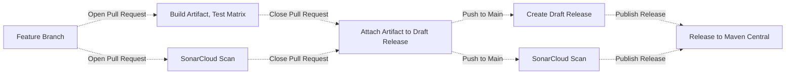
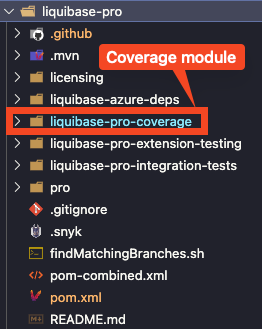

# Liquibase Reusable Workflows

## Introduction to GitHub Actions

With [GitHub Actions](https://github.com/features/actions), you can create custom workflows for the
software development lifecycle directly in your Github repository. These workflows consist of
different tasks, called actions, that can be executed automatically when certain events occur.

At Liquibase, we use GitHub Actions for a wide range of tasks involved in the build, test, and release of extensions.

## About reusable workflows

To avoid code duplication of GitHub Actions workflow files across thousands of repositories, we
utilize [reusable workflows](https://docs.github.com/en/actions/using-workflows/reusing-workflows).
This allows us to DRY (don't repeat yourself) configurations, so we don't have to copy and paste
workflows from one repository to another.

## Calling reusable workflows

In the calling workflow file, use the `uses` property to specify the location and version of a
reusable workflow file to run as a job.

```yml
name: { Job name }
on:
  pull_request:
jobs:
  { workflow }:
    uses: liquibase/build-logic/.github/workflows/{workflow}.yml@main
```

### Calling reusable workflows with parameters

`os-extension-test.yml` and `pro-extension-test.yml` are triggered by a workflow call event and runs tests for Liquibase extensions (os/pro) on different Java versions and operating systems. The `java` input specifies the Java versions to test, and the `os` input specifies the operating systems to test. Both inputs are required and have default values.

```yml
name: { Job name }
on:
  pull_request:
jobs:
  { workflow }:
    uses: liquibase/build-logic/.github/workflows/{workflow}.yml@main
    with:
      java: "[17, 18]"
      os: '["ubuntu-latest", "windows-latest"]'
```

If inputs are not provided, `'[8, 11, 17, 18]'` and `'["ubuntu-latest", "windows-latest"]'` will be used as default values

`package-deb.yml` is triggered by a workflow call event and runs some Maven goals needed to create and distribute `deb` packages. It has several inputs:

- **groupId**: Value from the `groupId` field in the pom file. i.e. `org.liquibase`
- **artifactId**: Value from the `artifactId` field in the pom file. i.e. `liquibase`
- **version**: Value from the `version` field in the pom file. i.e `4.23.1`

## Example Build/Test/Release Extension Workflow



Please review the below table of reusable workflows and their descriptions:

| Workflow                                | Description                                                                                                             |
| --------------------------------------- | ----------------------------------------------------------------------------------------------------------------------- |
| `build-artifact.yml`                    | Runs maven build and saves artifacts                                                                                    |
| `codeql.yml`                            | Runs CodeQL scanning                                                                                                    |
| `create-release.yml`                    | Runs Release Drafter to auto create draft release notes                                                                 |
| `fossa_ai.yml`                          | Runs FOSSA Scan for AI Generated Code                                                                                   |
| `ephemeral-cloud-infra.yml`             | Creates/Destroys test automation cloud infrastructure                                                                   |
| `extension-attach-artifact-release.yml` | Attaches a tested artifact to the draft release. Receives a `zip` input to upload generated zip files                   |
| `extension-release-published.yml`       | Publishes a release to Maven Central                                                                                    |
| `extension-update-version.yml`          | Updates release and development `pom.xml` versions                                                                      |
| `os-extension-automated-release.yml`    | Publishes draft releases and closes Nexus staging repositories. Details [here](./doc/os-extension-automated-release.md) |
| `os-extension-test.yml`                 | Unit tests across build matrix on previously built artifact                                                             |
| `package-deb.yml`                       | Creates and uploads deb packages                                                                                        |
| `pom-release-published.yml`             | Publishes a release pom to Maven Central                                                                                |
| `pro-extension-test.yml`                | Same as OS job, but with additional Pro-only vars such as License Key                                                   |
| `sonar-pull-request.yml`                | Code Coverage Scan for PRs. Requires branch name parameter                                                              |
| `sonar-test-scan.yml`                   | Code Coverage Scan for unit and integration tests                                                                       |
| `sonar-push.yml`                        | Same as PR job, but for pushes to main. Does not require branch name parameter                                          |
| various shell scripts                   | helper scripts for getting the draft release, signing artifacts, and uploading assets                                   |

## Requirements

### pom.xml

The pom must meet all the requirements from sonatype: https://central.sonatype.org/publish/requirements/#a-complete-example-pom

#### Jacoco

Jacoco must be configured and exporting test results.

```xml
<plugin>
    <groupId>org.jacoco</groupId>
    <artifactId>jacoco-maven-plugin</artifactId>
    <version>0.8.8</version>
    <configuration>
        <fileSets>
            <fileSet>
                <directory>target</directory>
                <includes>
                    <include>**/jacoco.exec</include>
                </includes>
            </fileSet>
        </fileSets>
    </configuration>
</plugin>
```

#### Surefire

All unit tests must run and pass with `surefire:test`. If any test require additional setup, such as docker, they will need to run separately from the reusable build logic.

```xml
<plugin>
    <artifactId>maven-surefire-plugin</artifactId>
    <version>2.22.2</version>
    <configuration>
        <redirectTestOutputToFile>true</redirectTestOutputToFile>
        <reportFormat>plain</reportFormat>
    </configuration>
</plugin>
```

#### Artifacts

The following artifacts must be created `mvn clean package`. If the javadoc and sources should not be public, please copy the contents of the readme for those files. This is based on the recommendation from sonatype: https://central.sonatype.org/publish/requirements/#supply-javadoc-and-sources.

- {artifactId}-{version}.jar
- {artifactId}-{version}.pom
- {artifactId}-{version}-javadoc.jar
- {artifactId}-{version}-sources.jar

```xml
<plugin>
    <groupId>com.coderplus.maven.plugins</groupId>
    <artifactId>copy-rename-maven-plugin</artifactId>
    <version>1.0</version>
    <executions>
        <execution>
            <id>copy</id>
            <phase>package</phase>
            <goals>
                <goal>copy</goal>
            </goals>
            <configuration>
                <fileSets>
                    <fileSet>
                        <sourceFile>${project.basedir}/pom.xml</sourceFile>
                        <destinationFile>${project.basedir}/target/${project.artifactId}-${project.version}.pom</destinationFile>
                    </fileSet>
                    <fileSet>
                        <sourceFile>${project.basedir}/README.md</sourceFile>
                        <destinationFile>${project.basedir}/target/${project.artifactId}-${project.version}-javadoc.jar</destinationFile>
                    </fileSet>
                    <fileSet>
                        <sourceFile>${project.basedir}/README.md</sourceFile>
                        <destinationFile>${project.basedir}/target/${project.artifactId}-${project.version}-sources.jar</destinationFile>
                    </fileSet>
                </fileSets>
            </configuration>
        </execution>
    </executions>
</plugin>
```

#### Maven release

The Maven release plugin must be configured to allow extensions update `pom.xml` versions:

```xml
<build>
    <plugins>
        <plugin>
            <groupId>org.apache.maven.plugins</groupId>
            <artifactId>maven-release-plugin</artifactId>
            <version>${maven-release-plugin.version}</version>
            <configuration>
                <scmCommentPrefix>[Version Bumped to ${project.version}]</scmCommentPrefix>
            </configuration>
        </plugin>
    </plugins>
</build>
```

## Liquibase Test Harness

| Workflow         | Description                                            |
| ---------------- | ------------------------------------------------------ |
| `lth-docker.yml` | Runs Liquibase Test Harness against a docker container |

### Docker Databases

#### Requirements

- Docker Compose file must be located in `src/test/resources/docker-compose.yml`

## Liquibase test (unit & integration tests) + Sonar

The `sonar-test-scan.yml` reusable workflow has been designed to execute unit and integration tests and deliver the Jacoco agregated report to Sonar.
Jacoco requires all generated reports to fulfill its merge goal. Running integration tests on separate runners complicates the aggregation of reports. This is why an optimized workflow has been created to launch all tests and generate a comprehensive aggregated report for Sonar. It utilizes [mvnd](https://github.com/apache/maven-mvnd) instead of `mvn`` to speed up the build and test process and it also creates one thread per core.

`sonar-test-scan.yml` can be run in parallel to the rest of the workflow steps since it builds the application by itself. With this, we managed not to interfere with the total final build time.

Here you can see an example for `liquibase-pro` executing all unit&integration for `-Dliquibase.sdk.testSystem.test=hub,h2,hsqldb,mssql,oracle`:


### Configuration

The project has to be configured with the following Maven plugins:

- [Maven Surefire Plugin](https://maven.apache.org/surefire/maven-surefire-plugin): Runs unit tests
- [Maven Failsafe Plugin](https://maven.apache.org/surefire/maven-failsafe-plugin/): Runs integration tests
- [Jacoco Plugin](https://www.eclemma.org/jacoco/trunk/doc/maven.html): Generates test reports and it also agreggates and merges all of them into a single report

For Maven multimodule projects it is recommended to follow this pattern from SonarSource where there is a specific module to leave the aggregated report:

- [Multi-module Apache Maven example](https://github.com/SonarSource/sonar-scanning-examples/blob/master/sonarqube-scanner-maven/maven-multimodule/README.md)

In the following example we demonstrate how `liquibase-pro` works:



#### Parent pom.xml

All modules need to specify where the final report will be generated setting the `sonar.coverage.jacoco.xmlReportPaths` property. In the parent pom there are 3 profiles to control which tests are executed and the required plugins are configured.

```xml
    <properties>
        <maven-failsafe-plugin.version>3.0.0-M7</maven-failsafe-plugin.version>
        <jacoco-maven-plugin.version>0.8.5</jacoco-maven-plugin.version>
        <maven-surefire-plugin.version>3.0.0-M7</maven-surefire-plugin.version>
        <code.coverage.project.folder>${basedir}/../</code.coverage.project.folder>
        <code.coverage.overall.data.folder>${basedir}/target/</code.coverage.overall.data.folder>
        <skip.integration.tests>true</skip.integration.tests>
        <skip.unit.tests>true</skip.unit.tests>
        <itCoverageAgent></itCoverageAgent>
        <sonar.coverage.jacoco.xmlReportPaths>liquibase-pro-coverage/target/site/jacoco-aggregate/jacoco.xml</sonar.coverage.jacoco.xmlReportPaths>
    </properties>

    <build>
        <plugins>
            <plugin>
                <groupId>org.apache.maven.plugins</groupId>
                <artifactId>maven-surefire-plugin</artifactId>
                <version>${maven-surefire-plugin.version}</version>
                <configuration>
                    <skipTests>${skip.unit.tests}</skipTests>
                    <excludes>
                        <exclude>liquibase-pro-integration-tests/**/*IntegrationTest.java</exclude>
                    </excludes>
                    <forkCount>1</forkCount>
                </configuration>
            </plugin>
            <plugin>
                <groupId>org.apache.maven.plugins</groupId>
                <artifactId>maven-failsafe-plugin</artifactId>
                <version>${maven-failsafe-plugin.version}</version>
                <executions>
                    <execution>
                        <id>integration-tests</id>
                        <goals>
                            <goal>integration-test</goal>
                        <goal>verify</goal>
                        </goals>
                        <configuration>
                            <skipTests>${skip.integration.tests}</skipTests>
                            <includes>
                                <include>**/*IntegrationTest.java</include>
                            </includes>
                            <reuseForks>true</reuseForks>
                            <argLine>${itCoverageAgent}</argLine>
                        </configuration>
                    </execution>
                </executions>
            </plugin>
            <plugin>
                <groupId>org.jacoco</groupId>
                <artifactId>jacoco-maven-plugin</artifactId>
                <version>${jacoco-maven-plugin.version}</version>
                <executions>
                    <execution>
                        <id>prepare-unit-tests</id>
                        <goals>
                            <goal>prepare-agent</goal>
                        </goals>
                    </execution>
                    <!-- prepare agent before integration tests -->
                    <execution>
                        <id>prepare-agent</id>
                        <goals>
                            <goal>prepare-agent</goal>
                        </goals>
                        <phase>pre-integration-test</phase>
                        <configuration>
                            <propertyName>itCoverageAgent</propertyName>
                        </configuration>
                    </execution>
                </executions>
            </plugin>
            <plugin>
                <groupId>org.sonarsource.scanner.maven</groupId>
                <artifactId>sonar-maven-plugin</artifactId>
                <version>3.9.1.2184</version>
                <executions>
                    <execution>
                        <id>sonar</id>
                        <goals>
                            <goal>sonar</goal>
                        </goals>
                    </execution>
                </executions>
            </plugin>
        </plugins>
    </build>
```

```xml
    <profile>
        <id>unit</id>
        <properties>
            <skip.integration.tests>true</skip.integration.tests>
            <skip.unit.tests>false</skip.unit.tests>
        </properties>
    </profile>
    <profile>
        <id>integration-test</id>
        <properties>
            <skip.integration.tests>false</skip.integration.tests>
            <skip.unit.tests>true</skip.unit.tests>
        </properties>
    </profile>
    <profile>
        <id>testAll</id>
        <properties>
            <skip.integration.tests>false</skip.integration.tests>
            <skip.unit.tests>false</skip.unit.tests>
        </properties>
    </profile>
```

#### modules with integration tests (pom.xml)

`maven-surefire-plugin` had to be added here because `liquibase-pro` integration tests are not following the `*ITest.java` or `*IntegrationTest.java` naming for integration tests.

```xml
    <properties>
        <sonar.coverage.jacoco.xmlReportPaths>${project.basedir}/../liquibase-pro-coverage/target/site/jacoco-aggregate/jacoco.xml</sonar.coverage.jacoco.xmlReportPaths>
    </properties>

    <build>
        <plugins>
            <plugin>
                <groupId>org.apache.maven.plugins</groupId>
                <artifactId>maven-surefire-plugin</artifactId>
                <configuration>
                    <skipTests>${skip.integration.tests}</skipTests>
                    <forkCount>1</forkCount>
                </configuration>
            </plugin>
        </plugins>
    </build>
```

#### Modules without integration tests (pom.xml)

```xml
    <properties>
        <sonar.coverage.jacoco.xmlReportPaths>${project.basedir}/../liquibase-pro-coverage/target/site/jacoco-aggregate/jacoco.xml</sonar.coverage.jacoco.xmlReportPaths>
    </properties>
```

#### Coverage module (pom.xml)

Here the modules we want to generate and aggregate test reports must be specified as `dependencies`.

```xml
    <properties>
        <sonar.coverage.jacoco.xmlReportPaths>target/site/jacoco-aggregate/jacoco.xml</sonar.coverage.jacoco.xmlReportPaths>
        <code.coverage.project.folder>${basedir}/../</code.coverage.project.folder>
        <code.coverage.overall.data.folder>${basedir}/target/</code.coverage.overall.data.folder>
        <sonar.skip>true</sonar.skip>
        <maven.deploy.skip>true</maven.deploy.skip>
    </properties>

    <dependencies>
        <dependency>
            <groupId>${project.groupId}</groupId>
            <artifactId>liquibase-commercial</artifactId>
            <version>${project.version}</version>
        </dependency>
            <dependency>
            <groupId>${project.groupId}</groupId>
            <artifactId>liquibase-commercial-integration-tests</artifactId>
            <version>${project.version}</version>
        </dependency>
    </dependencies>

    <build>
      <plugins>
        <plugin>
          <groupId>org.apache.maven.plugins</groupId>
          <artifactId>maven-surefire-plugin</artifactId>
          <configuration>
            <argLine>${argLine} -Xms256m -Xmx2048m</argLine>
            <forkCount>1</forkCount>
            <runOrder>random</runOrder>
          </configuration>
        </plugin>

        <plugin>
          <groupId>org.jacoco</groupId>
          <artifactId>jacoco-maven-plugin</artifactId>
          <executions>
            <execution>
              <id>report-aggregate</id>
              <phase>verify</phase>
              <goals>
                <goal>report-aggregate</goal>
              </goals>
            </execution>

            <execution>
              <id>merge-results</id>
              <phase>verify</phase>
              <goals>
                <goal>merge</goal>
              </goals>
              <configuration>
                <fileSets>
                  <fileSet>
                    <directory>${code.coverage.project.folder}</directory>
                    <includes>
                      <include>**/target/jacoco.exec</include>
                    </includes>
                  </fileSet>
                </fileSets>
                <destFile>${code.coverage.overall.data.folder}/aggregate.exec</destFile>
              </configuration>
            </execution>
          </executions>
        </plugin>
      </plugins>
    </build>
```

### Releasing a new version of build-logic

When you want to release new version of `build-logic`, it is important to update all the occurrences of previous version eg: `main` with the new version eg : `main` in all the files. As, the code for the new version internally refers to the old version.

_____________________________________________________________________________________________________________________________________________________________________________