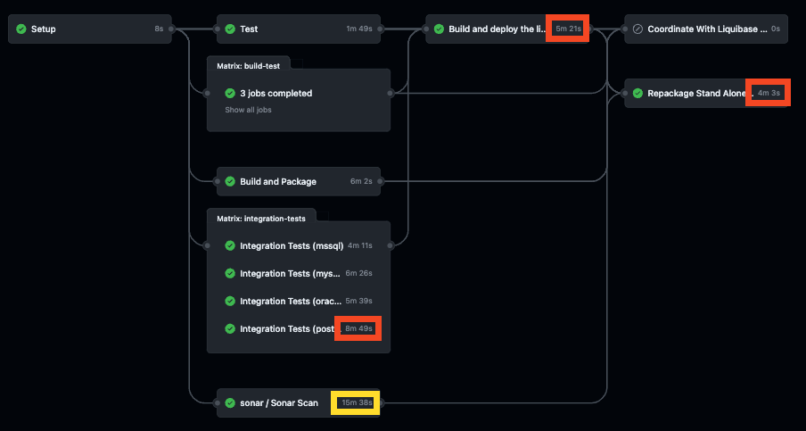
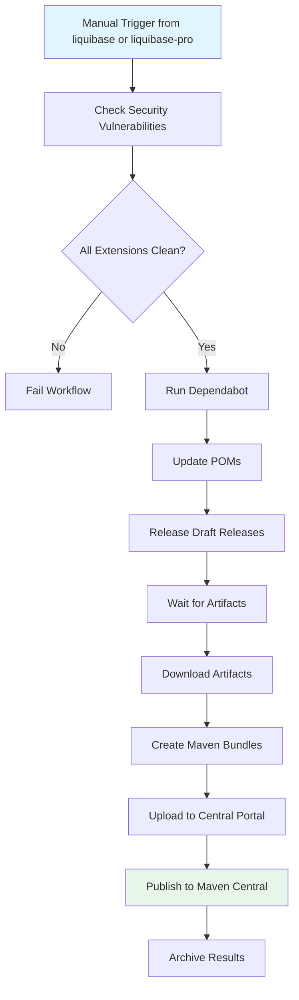

# Liquibase Reusable Workflows

## Introduction to GitHub Actions

With [GitHub Actions](https://github.com/features/actions), you can create custom workflows for the
software development lifecycle directly in your Github repository. These workflows consist of
different tasks, called actions, that can be executed automatically when certain events occur.

At Liquibase, we use GitHub Actions for a wide range of tasks involved in the build, test, and release of extensions.

## About reusable workflows

To avoid code duplication of GitHub Actions workflow files across thousands of repositories, we
utilize [reusable workflows](https://docs.github.com/en/actions/using-workflows/reusing-workflows).
This allows us to DRY (don't repeat yourself) configurations, so we don't have to copy and paste
workflows from one repository to another.

## Calling reusable workflows

In the calling workflow file, use the `uses` property to specify the location and version of a
reusable workflow file to run as a job.

```yml
name: { Job name }
on:
  pull_request:
jobs:
  { workflow }:
    uses: liquibase/build-logic/.github/workflows/{workflow}.yml@main
```

### Calling reusable workflows with parameters

`os-extension-test.yml` and `pro-extension-test.yml` are triggered by a workflow call event and runs tests for Liquibase extensions (os/pro) on different Java versions and operating systems. The `java` input specifies the Java versions to test, and the `os` input specifies the operating systems to test. Both inputs are required and have default values.

```yml
name: { Job name }
on:
  pull_request:
jobs:
  { workflow }:
    uses: liquibase/build-logic/.github/workflows/{workflow}.yml@main
    with:
      java: "[17, 18]"
      os: '["ubuntu-latest", "windows-latest"]'
```

If inputs are not provided, `'[8, 11, 17, 18]'` and `'["ubuntu-latest", "windows-latest"]'` will be used as default values

`package-deb.yml` is triggered by a workflow call event and runs some Maven goals needed to create and distribute `deb` packages. It has several inputs:

- **groupId**: Value from the `groupId` field in the pom file. i.e. `org.liquibase`
- **artifactId**: Value from the `artifactId` field in the pom file. i.e. `liquibase`
- **version**: Value from the `version` field in the pom file. i.e `4.23.1`

## Example Build/Test/Release Extension Workflow


Please review the below table of reusable workflows and their descriptions:

| Workflow                                | Description                                                                                                             |
| --------------------------------------- | ----------------------------------------------------------------------------------------------------------------------- |
| `build-artifact.yml`                    | Runs maven build and saves artifacts                                                                                    |
| `build-extension-jar.yml`               | Builds and deploys extension JARs to GitHub Package Manager                                                             |
| `cleanup-individual-artifacts.yml`      | Cleans up individual OS-specific artifacts across multiple operating systems                                            |
| `create-release.yml`                    | Runs Release Drafter to auto create draft release notes                                                                 |
| `dependabot-automerge.yml` | Automatically merges Dependabot PRs for minor and patch updates                                                                      |
| `fossa_ai.yml`                          | Runs FOSSA Scan for AI Generated Code                                                                                   |
| `ephemeral-cloud-infra.yml`             | Creates/Destroys test automation cloud infrastructure                                                                   |
| `extension-attach-artifact-release.yml` | Attaches a tested artifact to the draft release. Receives a `zip` input to upload generated zip files                   |
| `extension-release-prepare.yml`         | Prepares extension release artifacts                                                                                    |
| `extension-release-published.yml`       | Publishes a release to Maven Central                                                                                    |
| `extension-release-rollback.yml`        | Rolls back a failed extension release                                                                                   |
| `extension-update-version.yml`          | Updates release and development `pom.xml` versions                                                                      |
| `fossa.yml`                             | Runs FOSSA license compliance checks and uploads reports                                                                |
| `fossa_ai.yml`                          | Scans code for AI-generated content and runs FOSSA license compliance                                                   |
| `generate-upload-fossa-report.yml`      | Generates and uploads license reports to FOSSA                                                                          |
| `lth-docker.yml`                        | Runs Liquibase Test Harness on Docker-based databases                                                                   |
| `extension-automated-release.yml`       | Unified workflow for OSS and commercial extension releases with automatic publishing to Maven Central |
| `os-extension-test.yml`                 | Unit tests across build matrix on previously built artifact                                                             |
| `owasp-scanner.yml`                     | Runs vulnerability scans using OWASP dependency checker                                                                 |
| `package.yml`                           | Creates and distributes Linux packages (deb, rpm) and updates platform-specific repositories                            |
| `package-deb.yml`                       | Creates and uploads deb packages                                                                                        |
| `pom-release-published.yml`             | Publishes a release pom to Maven Central                                                                                |
| `pro-extension-build-for-liquibase.yml` | Builds and tests Pro extensions specifically for Liquibase                                                              |
| `pro-extension-test.yml`                | Same as OS job, but with additional Pro-only vars such as License Key                                                   |
| `publish-for-liquibase.yml`             | Publishes extensions for Liquibase consumption                                                                          |
| `slack-notification.yml`                | Sends notifications to Slack when tests fail                                                                            |
| `sonar-pull-request.yml`                | Code Coverage Scan for PRs. Requires branch name parameter                                                              |
| `sonar-test-scan.yml`                   | Code Coverage Scan for unit and integration tests                                                                       |
| `sonar-push.yml`                        | Same as PR job, but for pushes to main. Does not require branch name parameter                                          |
| various shell scripts                   | helper scripts for getting the draft release, signing artifacts, and uploading assets                                   |

## Requirements

### pom.xml

The pom must meet all the requirements from sonatype: https://central.sonatype.org/publish/requirements/#a-complete-example-pom

#### Jacoco

Jacoco must be configured and exporting test results.

```xml
<plugin>
    <groupId>org.jacoco</groupId>
    <artifactId>jacoco-maven-plugin</artifactId>
    <version>0.8.8</version>
    <configuration>
        <fileSets>
            <fileSet>
                <directory>target</directory>
                <includes>
                    <include>**/jacoco.exec</include>
                </includes>
            </fileSet>
        </fileSets>
    </configuration>
</plugin>
```

#### Surefire

All unit tests must run and pass with `surefire:test`. If any test require additional setup, such as docker, they will need to run separately from the reusable build logic.

```xml
<plugin>
    <artifactId>maven-surefire-plugin</artifactId>
    <version>2.22.2</version>
    <configuration>
        <redirectTestOutputToFile>true</redirectTestOutputToFile>
        <reportFormat>plain</reportFormat>
    </configuration>
</plugin>
```

#### Artifacts

The following artifacts must be created `mvn clean package`. If the javadoc and sources should not be public, please copy the contents of the readme for those files. This is based on the recommendation from sonatype: https://central.sonatype.org/publish/requirements/#supply-javadoc-and-sources.

- {artifactId}-{version}.jar
- {artifactId}-{version}.pom
- {artifactId}-{version}-javadoc.jar
- {artifactId}-{version}-sources.jar

```xml
<plugin>
    <groupId>com.coderplus.maven.plugins</groupId>
    <artifactId>copy-rename-maven-plugin</artifactId>
    <version>1.0</version>
    <executions>
        <execution>
            <id>copy</id>
            <phase>package</phase>
            <goals>
                <goal>copy</goal>
            </goals>
            <configuration>
                <fileSets>
                    <fileSet>
                        <sourceFile>${project.basedir}/pom.xml</sourceFile>
                        <destinationFile>${project.basedir}/target/${project.artifactId}-${project.version}.pom</destinationFile>
                    </fileSet>
                    <fileSet>
                        <sourceFile>${project.basedir}/README.md</sourceFile>
                        <destinationFile>${project.basedir}/target/${project.artifactId}-${project.version}-javadoc.jar</destinationFile>
                    </fileSet>
                    <fileSet>
                        <sourceFile>${project.basedir}/README.md</sourceFile>
                        <destinationFile>${project.basedir}/target/${project.artifactId}-${project.version}-sources.jar</destinationFile>
                    </fileSet>
                </fileSets>
            </configuration>
        </execution>
    </executions>
</plugin>
```

#### Maven release

The Maven release plugin must be configured to allow extensions update `pom.xml` versions:

```xml
<build>
    <plugins>
        <plugin>
            <groupId>org.apache.maven.plugins</groupId>
            <artifactId>maven-release-plugin</artifactId>
            <version>${maven-release-plugin.version}</version>
            <configuration>
                <scmCommentPrefix>[Version Bumped to ${project.version}]</scmCommentPrefix>
            </configuration>
        </plugin>
    </plugins>
</build>
```

### Version Bumping after Release

When releasing extensions, a Pull Request is automatically created to update the version in the `pom.xml` files instead of directly committing to the main branch. This approach provides the following benefits:

1. Improved security by requiring reviews before version changes are merged
2. Better traceability of version bumps through the PR history
3. Opportunity for validation before finalizing the version change

The PR creation is handled by the `extension-release-prepare.yml` workflow:

```yml
- name: Create Pull Request for version bump
  uses: peter-evans/create-pull-request@v7.0.8
  with:
    token: ${{ secrets.GITHUB_TOKEN }}
    commit-message: "chore: update version after release"
    title: "Version bump after release"
    body: |
      This PR updates the POM version after a release.

      Automated changes by GitHub Actions.
    branch: version-bump-after-release
    delete-branch: true
```

These version bump PRs are automatically merged through a nightly scheduled workflow (`auto_merge_release_prs.yml`) in the `liquibase-infrastructure` repository. This workflow:

1. Runs on a daily schedule (midnight UTC) or can be triggered manually
2. Identifies all repositories with the `extension` topic
3. Finds open PRs with the exact title "Version bump after release"
4. Merges these PRs using the squash strategy

This automation ensures that version bumps are consistently applied across all extension repositories without requiring manual intervention, while still maintaining the security benefits of the PR-based approach.

## Liquibase Test Harness

| Workflow         | Description                                            |
| ---------------- | ------------------------------------------------------ |
| `lth-docker.yml` | Runs Liquibase Test Harness against a docker container |

### Docker Databases

#### Requirements

- Docker Compose file must be located in `src/test/resources/docker-compose.yml`

## Liquibase test (unit & integration tests) + Sonar

The `sonar-test-scan.yml` reusable workflow has been designed to execute unit and integration tests and deliver the Jacoco agregated report to Sonar.
Jacoco requires all generated reports to fulfill its merge goal. Running integration tests on separate runners complicates the aggregation of reports. This is why an optimized workflow has been created to launch all tests and generate a comprehensive aggregated report for Sonar. It utilizes [mvnd](https://github.com/apache/maven-mvnd) instead of `mvn`` to speed up the build and test process and it also creates one thread per core.

`sonar-test-scan.yml` can be run in parallel to the rest of the workflow steps since it builds the application by itself. With this, we managed not to interfere with the total final build time.

Here you can see an example for `liquibase-pro` executing all unit&integration for `-Dliquibase.sdk.testSystem.test=hub,h2,hsqldb,mssql,oracle`:



### Configuration

The project has to be configured with the following Maven plugins:

- [Maven Surefire Plugin](https://maven.apache.org/surefire/maven-surefire-plugin): Runs unit tests
- [Maven Failsafe Plugin](https://maven.apache.org/surefire/maven-failsafe-plugin/): Runs integration tests
- [Jacoco Plugin](https://www.eclemma.org/jacoco/trunk/doc/maven.html): Generates test reports and it also agreggates and merges all of them into a single report

For Maven multimodule projects it is recommended to follow this pattern from SonarSource where there is a specific module to leave the aggregated report:

- [Multi-module Apache Maven example](https://github.com/SonarSource/sonar-scanning-examples/blob/master/sonarqube-scanner-maven/maven-multimodule/README.md)

In the following example we demonstrate how `liquibase-pro` works:


#### Parent pom.xml

All modules need to specify where the final report will be generated setting the `sonar.coverage.jacoco.xmlReportPaths` property. In the parent pom there are 3 profiles to control which tests are executed and the required plugins are configured.

```xml
    <properties>
        <maven-failsafe-plugin.version>3.0.0-M7</maven-failsafe-plugin.version>
        <jacoco-maven-plugin.version>0.8.5</jacoco-maven-plugin.version>
        <maven-surefire-plugin.version>3.0.0-M7</maven-surefire-plugin.version>
        <code.coverage.project.folder>${basedir}/../</code.coverage.project.folder>
        <code.coverage.overall.data.folder>${basedir}/target/</code.coverage.overall.data.folder>
        <skip.integration.tests>true</skip.integration.tests>
        <skip.unit.tests>true</skip.unit.tests>
        <itCoverageAgent></itCoverageAgent>
        <sonar.coverage.jacoco.xmlReportPaths>liquibase-pro-coverage/target/site/jacoco-aggregate/jacoco.xml</sonar.coverage.jacoco.xmlReportPaths>
    </properties>

    <build>
        <plugins>
            <plugin>
                <groupId>org.apache.maven.plugins</groupId>
                <artifactId>maven-surefire-plugin</artifactId>
                <version>${maven-surefire-plugin.version}</version>
                <configuration>
                    <skipTests>${skip.unit.tests}</skipTests>
                    <excludes>
                        <exclude>liquibase-pro-integration-tests/**/*IntegrationTest.java</exclude>
                    </excludes>
                    <forkCount>1</forkCount>
                </configuration>
            </plugin>
            <plugin>
                <groupId>org.apache.maven.plugins</groupId>
                <artifactId>maven-failsafe-plugin</artifactId>
                <version>${maven-failsafe-plugin.version}</version>
                <executions>
                    <execution>
                        <id>integration-tests</id>
                        <goals>
                            <goal>integration-test</goal>
                        <goal>verify</goal>
                        </goals>
                        <configuration>
                            <skipTests>${skip.integration.tests}</skipTests>
                            <includes>
                                <include>**/*IntegrationTest.java</include>
                            </includes>
                            <reuseForks>true</reuseForks>
                            <argLine>${itCoverageAgent}</argLine>
                        </configuration>
                    </execution>
                </executions>
            </plugin>
            <plugin>
                <groupId>org.jacoco</groupId>
                <artifactId>jacoco-maven-plugin</artifactId>
                <version>${jacoco-maven-plugin.version}</version>
                <executions>
                    <execution>
                        <id>prepare-unit-tests</id>
                        <goals>
                            <goal>prepare-agent</goal>
                        </goals>
                    </execution>
                    <!-- prepare agent before integration tests -->
                    <execution>
                        <id>prepare-agent</id>
                        <goals>
                            <goal>prepare-agent</goal>
                        </goals>
                        <phase>pre-integration-test</phase>
                        <configuration>
                            <propertyName>itCoverageAgent</propertyName>
                        </configuration>
                    </execution>
                </executions>
            </plugin>
            <plugin>
                <groupId>org.sonarsource.scanner.maven</groupId>
                <artifactId>sonar-maven-plugin</artifactId>
                <version>3.9.1.2184</version>
                <executions>
                    <execution>
                        <id>sonar</id>
                        <goals>
                            <goal>sonar</goal>
                        </goals>
                    </execution>
                </executions>
            </plugin>
        </plugins>
    </build>
```

```xml
    <profile>
        <id>unit</id>
        <properties>
            <skip.integration.tests>true</skip.integration.tests>
            <skip.unit.tests>false</skip.unit.tests>
        </properties>
    </profile>
    <profile>
        <id>integration-test</id>
        <properties>
            <skip.integration.tests>false</skip.integration.tests>
            <skip.unit.tests>true</skip.unit.tests>
        </properties>
    </profile>
    <profile>
        <id>testAll</id>
        <properties>
            <skip.integration.tests>false</skip.integration.tests>
            <skip.unit.tests>false</skip.unit.tests>
        </properties>
    </profile>
```

#### modules with integration tests (pom.xml)

`maven-surefire-plugin` had to be added here because `liquibase-pro` integration tests are not following the `*ITest.java` or `*IntegrationTest.java` naming for integration tests.

```xml
    <properties>
        <sonar.coverage.jacoco.xmlReportPaths>${project.basedir}/../liquibase-pro-coverage/target/site/jacoco-aggregate/jacoco.xml</sonar.coverage.jacoco.xmlReportPaths>
    </properties>

    <build>
        <plugins>
            <plugin>
                <groupId>org.apache.maven.plugins</groupId>
                <artifactId>maven-surefire-plugin</artifactId>
                <configuration>
                    <skipTests>${skip.integration.tests}</skipTests>
                    <forkCount>1</forkCount>
                </configuration>
            </plugin>
        </plugins>
    </build>
```

#### Modules without integration tests (pom.xml)

```xml
    <properties>
        <sonar.coverage.jacoco.xmlReportPaths>${project.basedir}/../liquibase-pro-coverage/target/site/jacoco-aggregate/jacoco.xml</sonar.coverage.jacoco.xmlReportPaths>
    </properties>
```

#### Coverage module (pom.xml)

Here the modules we want to generate and aggregate test reports must be specified as `dependencies`.

```xml
    <properties>
        <sonar.coverage.jacoco.xmlReportPaths>target/site/jacoco-aggregate/jacoco.xml</sonar.coverage.jacoco.xmlReportPaths>
        <code.coverage.project.folder>${basedir}/../</code.coverage.project.folder>
        <code.coverage.overall.data.folder>${basedir}/target/</code.coverage.overall.data.folder>
        <sonar.skip>true</sonar.skip>
        <maven.deploy.skip>true</maven.deploy.skip>
    </properties>

    <dependencies>
        <dependency>
            <groupId>${project.groupId}</groupId>
            <artifactId>liquibase-commercial</artifactId>
            <version>${project.version}</version>
        </dependency>
            <dependency>
            <groupId>${project.groupId}</groupId>
            <artifactId>liquibase-commercial-integration-tests</artifactId>
            <version>${project.version}</version>
        </dependency>
    </dependencies>

    <build>
      <plugins>
        <plugin>
          <groupId>org.apache.maven.plugins</groupId>
          <artifactId>maven-surefire-plugin</artifactId>
          <configuration>
            <argLine>${argLine} -Xms256m -Xmx2048m</argLine>
            <forkCount>1</forkCount>
            <runOrder>random</runOrder>
          </configuration>
        </plugin>

        <plugin>
          <groupId>org.jacoco</groupId>
          <artifactId>jacoco-maven-plugin</artifactId>
          <executions>
            <execution>
              <id>report-aggregate</id>
              <phase>verify</phase>
              <goals>
                <goal>report-aggregate</goal>
              </goals>
            </execution>

            <execution>
              <id>merge-results</id>
              <phase>verify</phase>
              <goals>
                <goal>merge</goal>
              </goals>
              <configuration>
                <fileSets>
                  <fileSet>
                    <directory>${code.coverage.project.folder}</directory>
                    <includes>
                      <include>**/target/jacoco.exec</include>
                    </includes>
                  </fileSet>
                </fileSets>
                <destFile>${code.coverage.overall.data.folder}/aggregate.exec</destFile>
              </configuration>
            </execution>
          </executions>
        </plugin>
      </plugins>
    </build>
```

### Releasing a new version of build-logic

When you want to release new version of `build-logic`, it is important to update all the occurrences of previous version eg: `main` with the new version eg : `main` in all the files. As, the code for the new version internally refers to the old version.


## 🔑 GitHub Tokens Strategy

Secure authentication and authorization are critical aspects of our CI/CD workflow. We employ different token types for various scenarios to optimize security and minimize GitHub API rate limit issues.

### 🔒 Default GITHUB_TOKEN

GitHub automatically provides a `GITHUB_TOKEN` secret that's available during workflow runs. This is a short-lived token that expires when the job completes.

#### When to use:

- For single-repository operations
- When no cross-repository access is needed
- For most common GitHub API operations within the same repository

#### Security benefits:

- Automatically rotated for each job
- Limited to the repository where the workflow runs
- [Permissions can be explicitly scoped](https://docs.github.com/en/actions/security-for-github-actions/security-guides/automatic-token-authentication) using the `permissions` key

```yml
permissions:
  id-token: write
  contents: write
  pull-requests: write
```

#### Example:

```yml
- name: Create Pull Request for version bump
  uses: peter-evans/create-pull-request@v7.0.8
  with:
    token: ${{ secrets.GITHUB_TOKEN }}
    commit-message: "chore: update version after release"
    title: "Version bump after release"
```

### 🔐 GitHub App Tokens

For operations that require cross-repository access or elevated permissions without using personal credentials, we use GitHub App tokens.

#### When to use:

- For cross-repository operations (cloning, checking out)
- When you need specific permissions across multiple repositories
- For operations that would exceed rate limits with `GITHUB_TOKEN`

#### Security benefits:

- Fine-grained permissions control
- No personal credentials involved
- Short-lived by default (can be configured)
- [Auditable through GitHub App activity](https://github.com/enterprises/liquibase/settings/audit-log?q=action%3Aoauth_application.generate_client_secret++). (Search filter: `action:oauth_application`)

#### Example:

```yml
- name: Get GitHub App token
  id: get-token
  uses: actions/create-github-app-token@v2
  with:
    app-id: ${{ env.LIQUIBASE_GITHUB_APP_ID }}
    private-key: ${{ env.LIQUIBASE_GITHUB_APP_PRIVATE_KEY }}
    owner: ${{ github.repository_owner }}
    permission-contents: read
    permission-packages: write

- name: Checkout code
  uses: actions/checkout@v4
  with:
    repository: ${{ inputs.repository }}
    token: ${{ steps.get-token.outputs.token }}
```

### 🪪 Personal Access Tokens (PATs)

While we minimize their use, PATs are sometimes necessary for specific scenarios where GitHub Apps or GITHUB_TOKEN aren't sufficient.

#### When to use:

- When GitHub App tokens cannot provide the necessary access
- For GitHub Package Manager (`GPM`) cross-repository access
- For legacy integrations that don't support other authentication methods

#### Security considerations:

- Store as encrypted repository secrets
- Use fine-grained PATs with minimum required scopes (`GPM` cross-repo deploys requires classic `PAT`)
- Regularly rotate tokens
- Consider using organization-level PATs instead of personal tokens

#### Example for GPM access:

```yml
- name: Maven settings with GPM access
  uses: whelk-io/maven-settings-xml-action@v22
  with:
    repositories: |
      [
        {
          "id": "github",
          "url": "https://maven.pkg.github.com/liquibase/*",
          "releases": {
            "enabled": "true"
          },
          "snapshots": {
            "enabled": "true"
          }
        }
      ]
    servers: |
      [
        {
          "id": "github",
          "username": "${{ github.actor }}",
          "password": "${{ env.LIQUIBOT_PAT_GPM_ACCESS }}"
        }
      ]
```

### 🛡️ Token Selection Strategy

Our approach to selecting tokens follows these principles:

1. **Default to GITHUB_TOKEN** when possible for its security and simplicity
2. **Use GitHub App tokens** for cross-repository operations
3. **Limit PAT usage** to only specialized cases where other token types don't suffice
4. **Scope permissions** explicitly for all token types
5. **Separate tokens** for different types of operations (deployment vs. reading)

This strategy helps us maintain security while ensuring our CI/CD workflows operate smoothly with appropriate permissions.

## Unified Extension Automated Release (OSS & Commercial)

The `extension-automated-release.yml` workflow is a unified release automation for both OSS and commercial/secure Liquibase extensions. It automatically publishes extensions to Maven Central.

**Supports:**
- **OSS Extensions:** BigQuery, Cache, Cassandra, CosmosDB, DB2i, FileChangelog, NoChangeLock, HanaDB, MaxDB, Modify Column, MSSQL, Oracle, PostgreSQL, Redshift, SQLFire, Teradata, Vertica, YugabyteDB, Hibernate, Parent POM
- **Commercial Extensions:** BigQuery, Databricks, MongoDB, Azure, AWS

### Triggering the Workflow

The workflow is called from orchestrator workflows in different repositories:

**For OSS Extensions** (liquibase repository):
```yml
name: Release Extensions
on:
  workflow_dispatch:
    inputs:
      version:
        description: 'Liquibase Version'
        required: true

jobs:
  automated-os-extensions-release:
    uses: liquibase/build-logic/.github/workflows/extension-automated-release.yml@main
    secrets: inherit
    with:
      version: ${{ inputs.version }}
      # Uses default OSS extension list
```

**For Commercial/Secure Extensions** (liquibase-pro repository):
```yml
name: Release Secure Extensions
on:
  workflow_dispatch:
    inputs:
      version:
        description: 'Liquibase Secure Version (e.g., 5.0.0, 5.0.1)'
        required: true

jobs:
  automated-secure-extensions-release:
    uses: liquibase/build-logic/.github/workflows/extension-automated-release.yml@main
    secrets: inherit
    with:
      version: ${{ inputs.version }}
      repositories: '["liquibase-commercial-bigquery","liquibase-commercial-databricks","liquibase-commercial-mongodb","liquibase-azure-extension","liquibase-aws-extension"]'
```

**To manually trigger a release:**

**For OSS Extensions:**
1. Navigate to the `liquibase` repository on GitHub
2. Go to **Actions** → **Release Extensions**
3. Click **Run workflow**
4. Enter the version number (e.g., `4.26.0`)
5. Click **Run workflow** to start

**For Commercial Extensions:**
1. Navigate to the `liquibase-pro` repository on GitHub
2. Go to **Actions** → **Release Secure Extensions**
3. Click **Run workflow**
4. Enter the version number (e.g., `4.26.0`)
5. Click **Run workflow** to start

### Workflow Inputs

- **version** (required): Version to release in semantic versioning format (e.g., `4.26.0`, `4.26.1`)
- **repositories** (optional): JSON array of repository names to release
  - Default: `["liquibase-bigquery", "liquibase-databricks", "liquibase-mongodb", "liquibase-azure", "liquibase-aws"]`
  - Can be customized to release specific extensions only

### Workflow Jobs

The workflow executes the following jobs in sequence:

#### 1. **check-security-vulnerabilities**
- Runs in parallel across all specified extension repositories
- Checks for open Dependabot security alerts using GitHub API
- Fails if any open security vulnerabilities are found
- Uses matrix strategy with `fail-fast: false` to check all repositories

**Log Messages:**
- INFO: "Checking repository: {repository}"
- INFO: "Security vulnerabilities for {repository} are addressed."
- ERROR: "Security vulnerabilities for {repository} are not addressed."

#### 2. **run-extensions-dependabot**
- Depends on: `check-security-vulnerabilities`
- Installs and runs Dependabot CLI on each extension repository
- Updates Maven dependencies automatically
- Runs in parallel across all repositories

#### 3. **update-pom**
- Depends on: `check-security-vulnerabilities`
- Updates extension versions to next SNAPSHOT
- Updates `liquibase.version` property in pom.xml
- Commits and pushes changes if modified
- Configures Maven settings for both `liquibase` and `liquibase-pro` repositories

**Important:** Maven settings include access to both OSS and Pro packages for commercial extension dependencies.

#### 4. **release-draft-releases**
- Depends on: `update-pom`
- Waits 180 seconds for artifacts to be available
- Finds draft releases containing the specified version
- Publishes draft releases (sets `draft: false`)
- Tracks published releases

#### 5. **publish-to-central-portal**
- Depends on: `release-draft-releases`
- Waits 120 seconds for releases to be fully available
- Downloads artifacts from published GitHub releases (jar, pom, asc, md5, sha1)
- Creates Maven repository layout bundles
- Uploads to Sonatype Central Portal with **AUTOMATIC** publishing
- Publishes to Maven Central (same as OSS extensions)

**Artifact Types Downloaded:**
- `.jar` - Extension JAR file
- `.pom` - Maven POM file
- `.asc` - GPG signatures (code signing)
- `.md5` and `.sha1` - Checksums

### Requirements

#### Repository Structure

Each commercial extension repository must:

1. Have a LICENSE file (LICENSE, LICENSE.md, or LICENSE.txt) in the root
2. Include FSL license headers in Java source files
3. Follow Maven project structure with pom.xml
4. Have draft releases ready with signed artifacts

#### Secrets Required

The following secrets must be available in AWS Secrets Manager (`/vault/liquibase`):

- `LIQUIBASE_GITHUB_APP_ID` - GitHub App ID for repository access
- `LIQUIBASE_GITHUB_APP_PRIVATE_KEY` - GitHub App private key
- `LIQUIBOT_PAT_GPM_ACCESS` - GitHub PAT for Maven Package access
- `SONATYPE_USERNAME` - Sonatype Central Portal username
- `SONATYPE_TOKEN` - Sonatype Central Portal token

#### Permissions

The workflow requires:
- `contents: write` - For releasing and updating repositories
- `security-events: read` - For checking Dependabot alerts
- `packages: write` - For Maven package operations
- `id-token: write` - For OIDC authentication with AWS

### Troubleshooting

#### Common Issues

**Issue: Security vulnerabilities not addressed**
- **Cause**: Open Dependabot alerts in repository
- **Solution**: Review and fix Dependabot alerts before releasing
- **Check**: GitHub repository → Security → Dependabot alerts

**Issue: No artifacts found in release**
- **Cause**: Draft release doesn't contain artifacts for the specified version
- **Solution**: Ensure draft release is created with proper version tag
- **Check**: GitHub repository → Releases → Draft releases

**Issue: Maven Central upload failed**
- **Cause**: Invalid credentials or artifact bundle structure
- **Solution**: Verify SONATYPE_USERNAME and SONATYPE_TOKEN in vault
- **Check**: Sonatype Central Portal deployment logs

**Issue: POM update failed**
- **Cause**: Maven settings not configured or missing dependencies
- **Solution**: Verify both liquibase and liquibase-pro repository access
- **Check**: Ensure LIQUIBOT_PAT_GPM_ACCESS is valid

### Release Process Flow



### Success Criteria

A successful release completes when:

1. ✅ All security vulnerabilities addressed across all extensions
2. ✅ POM versions updated and committed
3. ✅ Draft releases published to GitHub
4. ✅ Artifacts uploaded to Maven Central via Sonatype Central Portal
5. ✅ Deployment IDs logged for tracking

### Monitoring

- **GitHub Actions**: View workflow runs in `liquibase` (OSS) or `liquibase-pro` (commercial) repositories
- **Maven Central**: Track deployment status at https://central.sonatype.com/publishing/deployments
- **Artifacts**: Published extensions artifact uploaded with deployment IDs
- **Logs**: All jobs log INFO/WARNING/ERROR messages for easy debugging
